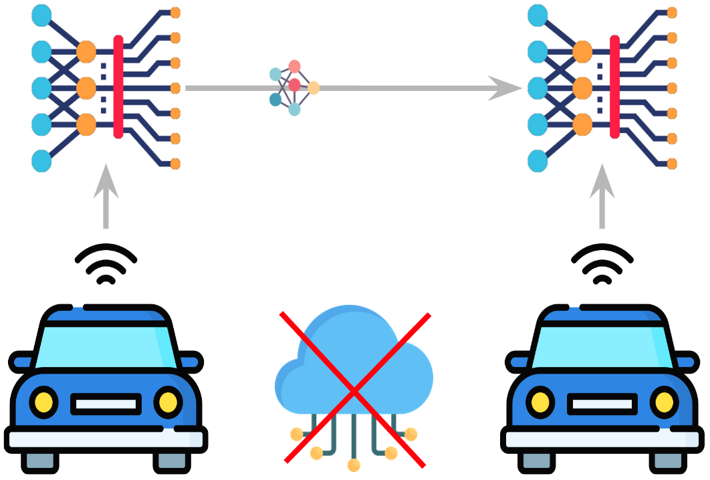
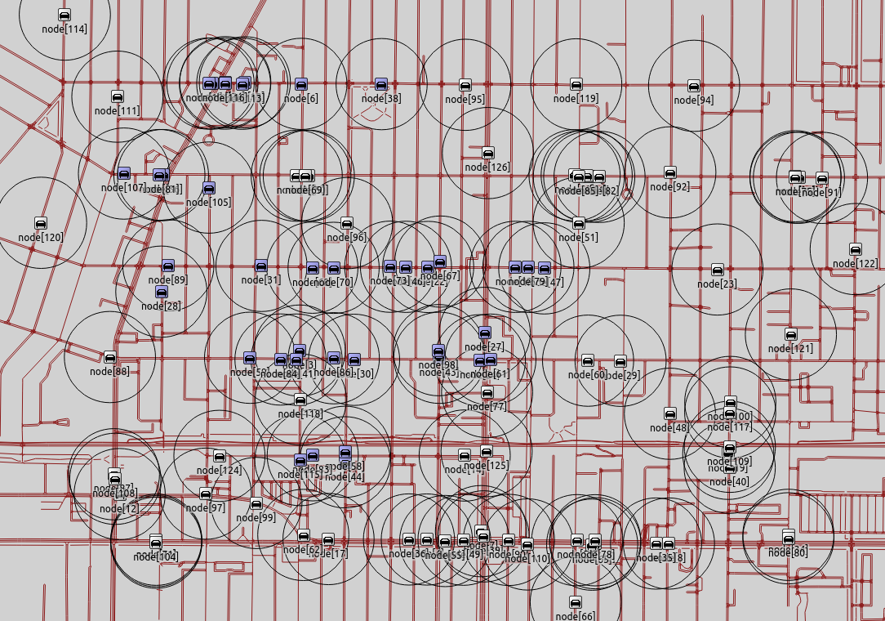
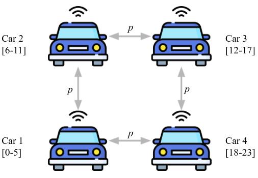
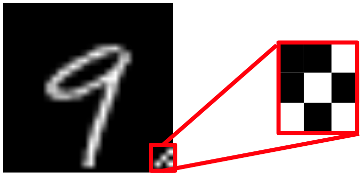

# DJGrad
The goal of this project is to create a network protocol capable of sending machine ML model updates between CAVs that are level 2-4 (human-in-the-loop), without the need for cloud communication or cellular networks.

  

We are interested in understanding the following aspects of our protocol:

1. **Networking:** How  well do  model gradients  spreadin  realistic  driving  environments?
    - See [veins-dsrc](veins-dsrc) folder

  

2. **Learning:** Does our distributed learning protocol positively impact learning?
    - See [learning_sim](learning_sim) folder

  

3. **Security & Privacy:** How can a malicious vehicle attack other vehicles by exploiting this distributed learning protocol?
    - See [security](security) folder

  

